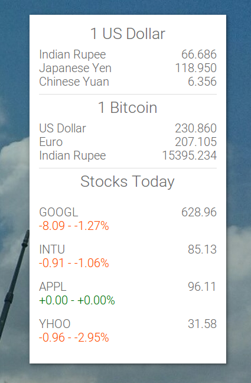

Conky Finance
=============

Google Now style Material Design conky to monitor your favourite stock prices and currencies.

<p align="center">

</p>
 
## Currency conversion

Create a file in the folder ```currency.conf``` with the name of the currency (the one you want to be displayed). First line in the file should contain the currency code of the currency you want to convert from. Next few lines should contain the currency codes of the currencies you want to convert to. See [this](currency.conf) to see examples.

## Stock prices

Add the stock symbol to ```stocks.conf```. See [this](stocks.conf) to see examples.

## Installation

To generate and install ```.conkyrc```
```
./install
```
This requires the font Roboto. To download and install it
```
./install-fonts
```

## Todo

1. Graphs of stock prices.
2. Support all types of stocks.
3. Come up with a cool name for this.

Inspired by [this](http://www.omgubuntu.co.uk/2013/05/google-now-themed-conky-for-ubuntu-desktop).
